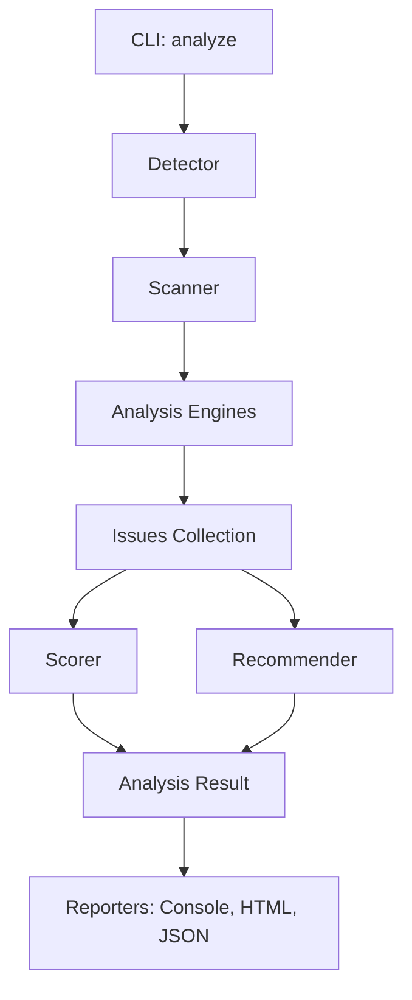

# Architecture Overview

The **Next Optimize Platform** is designed with a highly modular and extensible architecture, separating concerns between environment detection, static analysis, runtime monitoring, and reporting.

## Core Components

### 1. The Scanner (Orchestrator)
The `Scanner` is the central engine that manages the execution lifecycle:
- **Detection**: Uses the `Detector` to identify the project framework (Next.js, React, etc.), build tools (Webpack, Vite), and package managers.
- **Engine Execution**: Runs a collection of specialized `AnalysisEngines` based on their applicability to the detected project.
- **Scoring**: Delegates to the `Scorer` to compute a weighted performance score (0-100).
- **Prioritization**: Delegates to the `Recommender` to generate actionable suggestions sorted by impact.

### 2. Analysis Engines
Each engine in `src/engines/` is a self-contained module that focuses on a single performance category:
- **Static Engines**: Parse source code using `ts-morph` (TypeScript AST) to find anti-patterns (e.g., missing `memo`, prop drilling).
- **Build Engines**: Analyze generated artifacts (dist/build folders) and configuration files.

### 3. Real-time Telemetry System
The platform bridges the gap between static and dynamic analysis:
- **Browser Agent**: A lightweight script injected into the client application. It patches global `fetch`, uses `PerformanceObserver` for layout shifts/long tasks, and monitors memory.
- **Metrics Server**: A local WebSocket server (`ws`) that receives real-time telemetry from the agent and provides immediate CLI feedback.

## Data Flow

## Technology Stack
- **Language**: TypeScript (Strict Mode)
- **Tooling**: Commander.js (CLI), ts-morph (AST), ws (WebSockets), Chalk/Ora (UX)
- **Module System**: ESM (NodeNext)
