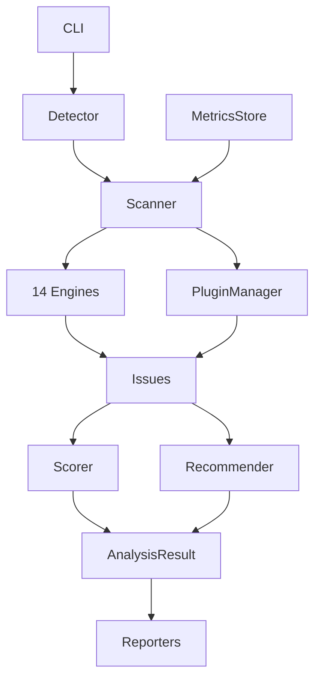

# Architecture

The Next Optimize Platform uses a modular pipeline architecture.

## Data Flow



## Core Components

### Detector
Fingerprints the project: framework, build tool, package manager, Node version.

### Scanner
Orchestrates engine execution, plugin loading, scoring, and recommendation generation.

### Analysis Engines
Self-contained modules in `src/engines/`. Each implements:
- `isApplicable(project)` — should this engine run?
- `analyze(project)` — return issues

### Scorer
Weighted 0–100 scoring with per-category breakdown and severity deductions.

### Recommender
Deduplicates and prioritizes suggestions by impact and effort.

## Directory Structure

```
src/
├── cli/           # Commander.js CLI
├── core/          # Scanner, Detector, Scorer, Recommender
├── engines/       # 14 analysis engines
├── reporting/     # Console, HTML, JSON, Markdown, SARIF
├── server/        # WebSocket + HTTP dashboard
├── agent/         # Browser telemetry script
├── baseline/      # Regression baseline management
├── ai/            # Fix suggestion engine
├── plugins/       # Plugin manager
├── optimize/      # Codemod engine
└── types/         # Shared TypeScript types
```

## Technology Stack

| Tool | Purpose |
|------|---------|
| TypeScript | Language (strict, ESM) |
| Commander.js | CLI framework |
| ts-morph | AST parsing |
| ws | WebSocket server |
| esbuild | Agent bundling |
| Chalk + Ora | Terminal UX |
