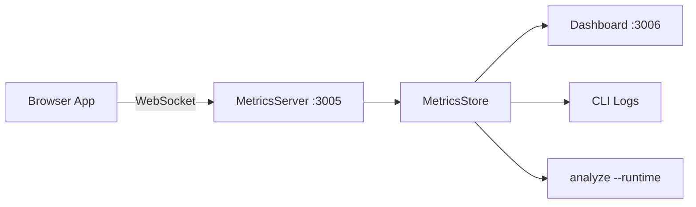

# Runtime Monitoring

Bridge the gap between static analysis and real-world performance.

## Architecture



## Quick Start

```bash
# Start monitor + dashboard
next-optimize monitor

# Dashboard
open http://localhost:3006/dashboard
```

## Agent Injection

```html
<script src="/path/to/next-optimize/dist/agent/agent.js"></script>
```

## Metrics Captured

| Type | Data |
|------|------|
| `api` | URL, duration, status, method |
| `render` | Component name, duration |
| `memory` | heapUsed, heapTotal, heapLimit |
| `event` | long-task, LCP, CLS, FCP |

## Runtime Correlation

After monitoring your app, run:

```bash
next-optimize analyze --runtime
```

This merges runtime findings (slow renders, slow APIs, high memory) with static analysis issues.

## traceRender Helper

```tsx
import { useEffect, useRef } from 'react';

function MyComponent() {
  const start = useRef(performance.now());
  useEffect(() => {
    const duration = performance.now() - start.current;
    (window as any).nextOptimizeAgent?.traceRender('MyComponent', duration);
  });
  return <div>...</div>;
}
```
