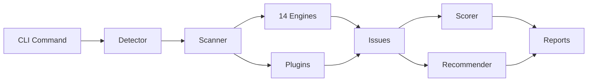

# Next Optimize Platform

Next Optimize is a production-grade CLI tool that **analyzes**, **monitors**, and **optimizes** React and Next.js applications for performance, stability, and scalability.

<CardGroup cols={2}>
  <Card title="Static Analysis" icon="magnifying-glass" href="/engines/overview">
    14 specialized engines scan your codebase for anti-patterns using deep AST parsing.
  </Card>
  <Card title="Real-time Monitoring" icon="chart-line" href="/guides/runtime-monitoring">
    Browser agent captures live API, render, and memory metrics via WebSocket.
  </Card>
  <Card title="CI/CD Integration" icon="shield-check" href="/guides/ci-cd">
    Fail builds on performance regressions with baseline diffing and SARIF output.
  </Card>
  <Card title="Auto-Optimize" icon="wand-magic-sparkles" href="/commands/optimize">
    Apply safe codemods and get AI-assisted fix suggestions.
  </Card>
</CardGroup>

## How It Works



1. **Detect** your project framework, build tool, and package manager
2. **Scan** with 14 specialized analysis engines + custom plugins
3. **Score** performance 0–100 across 8 weighted categories
4. **Recommend** prioritized fixes sorted by impact and effort
5. **Report** via Console, HTML, JSON, Markdown, or SARIF

## Key Features

| Feature | Description |
|---------|-------------|
| **14 Analysis Engines** | Bundle, Component, Render, RSC, Web Vitals, Memory, Image, API, Build, Dependency, Monorepo, Framework |
| **Performance Scoring** | Weighted 0–100 score with per-category breakdown |
| **Live Dashboard** | Real-time metrics at `http://localhost:3006/dashboard` |
| **Baseline Regression** | Compare against saved baselines in CI |
| **SARIF Output** | GitHub Code Scanning integration |
| **Monorepo Support** | Scan all workspace packages with `--workspace` |
| **VS Code Extension** | Inline diagnostics and one-click analysis |
| **Plugin System** | Extend with custom rules |

## Quick Example

```bash
# Install
npm install -g next-optimize

# Analyze your project
npx next-optimize analyze

# Start live monitoring
npx next-optimize monitor

# CI with regression check
npx next-optimize ci --threshold 80 --baseline
```
